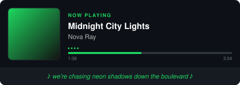
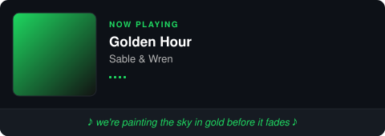
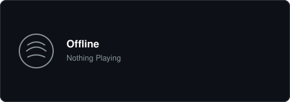
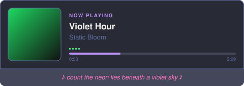

# Spotify Lyrics Badge

A dynamic SVG card for your GitHub profile README that shows what you're **currently listening to**, synced with the matching **lyric line from LRCLIB**. Hosted as a single Vercel Serverless Function. Supports two data sources: the free **Last.fm** scrobble bridge (works on Spotify Free, no OAuth) and the native **Spotify API** (second-accurate sync, but Spotify currently requires Premium even for read-only playback data — see [Providers / Setup Modes](#providers--setup-modes)).

[](https://vercel.com/new/clone?repository-url=https://github.com/ibrahim-isikli/spotify-lyrics-badge&env=LASTFM_API_KEY,LASTFM_USER,SPOTIFY_CLIENT_ID,SPOTIFY_CLIENT_SECRET,SPOTIFY_REFRESH_TOKEN&envDescription=Fill%20in%20either%20the%20LASTFM_*%20pair%20or%20the%20SPOTIFY_*%20trio%20%E2%80%94%20see%20README%20Providers%20section&envLink=https://github.com/ibrahim-isikli/spotify-lyrics-badge%23providers--setup-modes&project-name=spotify-lyrics-badge&repository-name=spotify-lyrics-badge)

## Overview / Features

- **Minimal, dark card design** inspired by [natemoo-re/novatorem](https://github.com/natemoo-re/novatorem) — rounded corners, muted palette, animated equalizer bars.
- **Themeable via URL query parameters** — six built-in presets (`default`, `dracula`, `catppuccin`, `tokyo-night`, `nord`, `light`) plus per-field color/radius/border overrides, no redeploy needed. See [🎨 Customization & Themes](#-customization--themes).
- **Dual-provider playback source** — reads live "now playing" data from either the native Spotify API or Last.fm's scrobble bridge (see [Providers / Setup Modes](#providers--setup-modes)), whichever is configured. Falls back to the most recently played track when nothing is active right now.
- **Real-time lyric matching** — fetches synced lyrics (`syncedLyrics`) from [LRCLIB](https://lrclib.net), parses the `[mm:ss.xx]` timestamps, and picks the line matching the track's current playback position. Last.fm doesn't report a live position on its own; with an optional linked Redis store, an [Estimated Sync](#estimated-sync-optional-lastfm-only) feature approximates it instead of showing a fixed line.
- **Zero-dependency SVG rendering** — the card itself is built from a plain template string, no headless browser, no canvas, no external render service. Album art is downloaded once per request and inlined as a base64 `data:` URI so GitHub's Camo image proxy never has to follow a third-party image link.
- **Edge/Serverless friendly** — a stateless function by default; Estimated Sync is the one opt-in feature that uses external storage (a linked Redis store), and the badge works exactly as before if it isn't configured.
- **Cache-aware** — response headers are tuned so Camo doesn't freeze on a stale "now playing" snapshot.
- **Optional live page** — `/live` auto-refreshes the card every few seconds client-side, for a genuinely real-time view outside the static-image constraints of a README. See [Live page](#live-page-real-time-outside-the-readme).

## Live Preview / Demo

The samples below are generated straight from the real render pipeline (`npm run generate:previews`), using mock playback data — see [Regenerating the previews](#regenerating-the-previews) for how to reproduce them.

| Spotify mode (live progress) | Last.fm mode (no live position) | Nothing playing (fallback) |
| --- | --- | --- |
|  |  |  |

## 🎨 Customization & Themes

Every visual aspect of the card is driven by URL query parameters — no fork, no redeploy, no build step. Parsing and validation live in `lib/theme.ts`.

### Built-in themes

Pass `?theme=<name>` to apply a preset. Unknown or omitted values fall back to `default`.

| Theme | Preview palette | Example URL |
| --- | --- | --- |
| `default` |  | `?theme=default` |
| `dracula` |  | `?theme=dracula` |
| `catppuccin` |  | `?theme=catppuccin` |
| `tokyo-night` |  | `?theme=tokyo-night` |
| `nord` |  | `?theme=nord` |
| `light` |  | `?theme=light` |

Static example with `?theme=dracula`:



### Live theme gallery

These are pulled live from the maintainer's own deployment — same URL, one query param changed per card — so what you see is a real, current (or "Nothing Playing" if nothing's active right now) render in each theme, not a mockup.

<table align="center">
  <tr>
    <td align="center">
      <br />
      <sub><code>?theme=default</code></sub>
    </td>
    <td align="center">
      <br />
      <sub><code>?theme=dracula</code></sub>
    </td>
  </tr>
  <tr>
    <td align="center">
      <br />
      <sub><code>?theme=catppuccin</code></sub>
    </td>
    <td align="center">
      <br />
      <sub><code>?theme=tokyo-night</code></sub>
    </td>
  </tr>
  <tr>
    <td align="center">
      <br />
      <sub><code>?theme=nord</code></sub>
    </td>
    <td align="center">
      <br />
      <sub><code>?theme=light</code></sub>
    </td>
  </tr>
</table>

### Query parameters

Individual colors override the selected theme's field on top of it — you can mix a preset with one or two custom colors, or go fully custom from `default`. Color values accept a hex code with or without the leading `#` (`ff79c6` or `#ff79c6`) or a bare CSS color keyword (`tomato`); anything else is ignored and the theme's default is kept.

| Parameter | Default | Description |
| --- | --- | --- |
| `theme` | `default` | One of the built-in theme names above. |
| `bg_color` | theme's `background` | Card background color. |
| `title_color` | theme's `title` | Track title text color. |
| `artist_color` | theme's `artist` | Artist name / muted text (time labels, icons) color. |
| `lyrics_color` | theme's `lyrics` | Footer lyric line color. |
| `bar_color` | theme's `progressBar` | Progress bar fill and "NOW PLAYING" label color. |
| `border_color` | theme's `border` | Card and album-art border color. |
| `border_radius` | `10` | Corner radius in pixels, `0`–`85`. `0` gives sharp square corners. |
| `show_border` | `true` | Set to `false` to make the border transparent. |

### Examples

```markdown
<!-- Dracula theme -->


<!-- Custom colors -->


<!-- Preset + one overridden color, no border, sharp corners -->

```

## Quick Start & Deployment

### 1. Deploy

Click **Deploy with Vercel** above, or manually:

```bash
git clone https://github.com/ibrahim-isikli/spotify-lyrics-badge.git
cd spotify-lyrics-badge
npm install
npx vercel --prod
```

### 2. Configure environment variables

Pick **one** provider and fill in only its variables — see [Providers / Setup Modes](#providers--setup-modes) for how to obtain each. Set these in the Vercel deploy dialog, or later under **Project → Settings → Environment Variables**:

| Variable | Provider | Description |
| --- | --- | --- |
| `LASTFM_API_KEY` | Last.fm (Option A) | Free API key from your Last.fm account. |
| `LASTFM_USER` | Last.fm (Option A) | Your Last.fm username (the one scrobbling from Spotify). |
| `SPOTIFY_CLIENT_ID` | Spotify (Option B, requires Premium) | Client ID of your app from the Spotify Developer Dashboard. |
| `SPOTIFY_CLIENT_SECRET` | Spotify (Option B, requires Premium) | Client Secret of the same app. |
| `SPOTIFY_REFRESH_TOKEN` | Spotify (Option B, requires Premium) | Long-lived refresh token obtained once via the OAuth authorization code flow. |

If both `LASTFM_API_KEY`/`LASTFM_USER` and `SPOTIFY_REFRESH_TOKEN` are set, Last.fm takes priority (see `lib/provider.ts`). If neither is set, the badge renders the offline fallback card.

Not in this table: if you link a Redis store to the project for [Estimated Sync](#estimated-sync-optional-lastfm-only), Vercel injects its variables (`KV_REST_API_URL`/`KV_REST_API_TOKEN` or `UPSTASH_REDIS_REST_URL`/`UPSTASH_REDIS_REST_TOKEN`) automatically — there's nothing to type in for that part.

### 3. Verify

Open `https://your-domain.vercel.app/api/spotify-lyrics` in a browser — you should see the SVG card render directly.

## Providers / Setup Modes

### Option A (Recommended for Free Users): Last.fm Bridge

Last.fm's free scrobbling service already tracks what you play on Spotify — no Spotify Developer app, no OAuth flow, and it works on **Spotify Free** too.

1. Create a free [Last.fm](https://www.last.fm) account if you don't have one, then connect it to Spotify: **Settings → Applications → Spotify** on last.fm, and authorize it. Play something on Spotify once to confirm scrobbles show up on your Last.fm profile.
2. Get a free API key at [last.fm/api/account/create](https://www.last.fm/api/account/create) — no credit card, issued instantly. You only need the **API Key** value it gives you.
3. Set these in your Vercel project's Environment Variables:

   | Variable | Value |
   | --- | --- |
   | `LASTFM_API_KEY` | The API key from step 2. |
   | `LASTFM_USER` | Your Last.fm username. |

That's it — no `SPOTIFY_*` variables needed for this mode. Because Last.fm's `user.getrecenttracks` endpoint doesn't expose a live playback position, the exact-second sync that Option B gets isn't available here — but see **Estimated Sync** below for a close approximation.

#### Estimated Sync (optional, Last.fm only)

Last.fm never reports *where* in the track playback is — only *that* something is playing. Without any extra setup, the card falls back to a fixed, representative lyric line per song (see `pickShowcaseLine` in `lib/lyrics.ts`). If you'd rather have the lyric line advance as the song plays, link a free Redis store to the project:

1. In the Vercel Dashboard, open your project → **Storage** tab → **Create Database** → choose a Redis option (Marketplace → Upstash for Redis is the standard choice) → **Connect to Project**. Vercel injects the required environment variables automatically — nothing to type in by hand.
2. Redeploy. `lib/provider.ts` will now record, on first sight of each new track, the moment it started, and estimate elapsed playback time on every later request — advancing the lyric line accordingly (`lib/progress-estimator.ts`).

This is an **approximation, not a measurement**: it can't detect pausing, seeking, or skipping ahead — it only knows "this exact track has been playing for N seconds since we first noticed it." It's meaningfully closer to real sync than a fixed line, but won't be second-perfect the way Option B is. If no store is linked, the badge works exactly as before (fixed line) — this is purely additive and never required.

### Option B: Native Spotify API (second-accurate sync, requires Premium)

The Spotify Web API currently **blocks access to the playback-reading endpoints** (`currently-playing`, `recently-played`) for apps whose owner doesn't have an active Premium subscription — confirmed directly against Spotify's API, which returns `403: "Active premium subscription required for the owner of the app."` for both endpoints on a Free account. So despite these being read-only endpoints, Premium is currently a hard requirement for this option, not just for playback-control endpoints. If you have Premium, this gets you exact, second-accurate lyric sync via `progressMs` (and the progress bar) — the Last.fm bridge above (with or without Estimated Sync) is the option for Free accounts.

1. Go to the [Spotify Developer Dashboard](https://developer.spotify.com/dashboard) and log in.
2. Click **Create app**, give it any name/description that doesn't start with "Spot" (Spotify blocks that in app names).
3. Under **Redirect URIs**, add `http://127.0.0.1:8888/callback` and click **Add** (only used to capture the one-time authorization code; Spotify requires the literal loopback IP, not `localhost`, for HTTP redirect URIs).
4. Check the "Web API" usage checkbox if selectable (it's fine if it's greyed out/pre-selected) and agree to the terms, then **Save**.
5. Open **Settings** on the new app and copy the **Client ID** and **Client Secret**.
6. Visit the following URL in your browser, replacing `CLIENT_ID`:

   ```
   https://accounts.spotify.com/authorize?client_id=CLIENT_ID&response_type=code&redirect_uri=http://127.0.0.1:8888/callback&scope=user-read-currently-playing%20user-read-playback-state%20user-read-recently-played
   ```

7. Approve the request. You'll be redirected to `http://127.0.0.1:8888/callback?code=...` (the page itself will fail to load — that's expected, just copy the `code` query parameter from the address bar).
8. Exchange that code for a refresh token:

   ```bash
   curl -X POST https://accounts.spotify.com/api/token \
     -H "Authorization: Basic $(echo -n 'CLIENT_ID:CLIENT_SECRET' | base64 -w 0)" \
     -d grant_type=authorization_code \
     -d code=PASTE_YOUR_CODE_HERE \
     -d redirect_uri=http://127.0.0.1:8888/callback
   ```

9. Copy the `refresh_token` field from the JSON response — this is your `SPOTIFY_REFRESH_TOKEN`. It doesn't expire under normal use, so this is a one-time setup step.
10. Set `SPOTIFY_CLIENT_ID`, `SPOTIFY_CLIENT_SECRET`, and `SPOTIFY_REFRESH_TOKEN` in your Vercel project's Environment Variables. If `LASTFM_API_KEY`/`LASTFM_USER` are also set, remove them (or leave `SPOTIFY_REFRESH_TOKEN` unset) so `lib/provider.ts` picks the provider you actually want — see the priority note above.

## Usage

Once deployed, embed the badge in any GitHub profile or project README:

```markdown

```

Or with HTML, if you want to control sizing:

```html

```

### Live page (real-time, outside the README)

`GET /live` is a small standalone page (`public/live.html`) that shows the same card but re-fetches it every 3 seconds client-side, so the lyric line visibly advances while you watch — something a static `` in a README can't do, since GitHub strips `<script>`/`<iframe>` from rendered Markdown for security. Visit it directly:

```
https://your-domain.vercel.app/live
```

It's not embeddable inside the README itself, but you can link to it from one:

```markdown
[🔴 Watch it live](https://your-domain.vercel.app/live)
```

Query parameters (theme, colors, etc. — see below) work here too, e.g. `/live?theme=dracula`.

## Local Development

```bash
npm install
cp .env.example .env   # fill in either the LASTFM_* pair or the SPOTIFY_* trio
npx vercel dev
```

Then open `http://localhost:3000/api/spotify-lyrics`.

### Type checking

```bash
npm run type-check
```

### Running the tests

```bash
npm test
```

Runs assertion-based checks (`scripts/test.ts`) against the LRC parsing/selection logic, the Last.fm/provider selection logic, and the `parseThemeParams` query-string logic (preset selection, color overrides/sanitization, `border_radius` clamping, `show_border`), with `fetch` mocked so no network access or real credentials are needed.

### Regenerating the previews

The card templates in `lib/render.ts` can be exercised offline, without any real Spotify or Last.fm account, using the mock-data script:

```bash
npm run generate:previews
```

This renders the Spotify-mode, Last.fm-mode, and offline preview cards, a themed example (`?theme=dracula`), and a small palette swatch per built-in theme — all through the exact same `renderNowPlayingCard` / `renderOfflineCard` / `parseThemeParams` used in production — and writes them into `assets/`.

## How It Works

1. `GET /api/spotify-lyrics` calls `lib/provider.ts`, which picks a data source based on which environment variables are set: Last.fm (`lib/lastfm.ts`) if `LASTFM_API_KEY`/`LASTFM_USER` are configured, otherwise Spotify (`lib/spotify.ts`) if `SPOTIFY_REFRESH_TOKEN` is configured. Both return the same provider-agnostic `TrackInfo` shape. Spotify falls back to `recently-played` when nothing is currently playing; Last.fm falls back to the last scrobble.
2. If the Last.fm provider was used and a Redis store is linked to the project, `lib/provider.ts` also calls `lib/progress-estimator.ts`, which remembers (in that store) the moment each new track was first seen playing and returns the elapsed time since then as an approximate `progressMs` — see [Estimated Sync](#estimated-sync-optional-lastfm-only). Without a linked store, this step is skipped entirely and nothing about the response changes.
3. If a track is found, `lib/lyrics.ts` queries LRCLIB with `track_name`/`artist_name` (and `duration` when known), parses the `[mm:ss.xx]` synced-lyrics timestamps into milliseconds, and selects the line matching the track's `progressMs` when that's available (Spotify, or Last.fm with Estimated Sync), or a representative showcase line when it isn't. If no synced lyrics exist, it falls back to the first line of plain lyrics, and finally to `"♫ Instrumental or No Lyrics Found ♫"`.
4. In parallel, `lib/theme.ts` parses the request's URL query parameters into a `StyleConfig` — a built-in theme (or `default`) with any `*_color`/`border_radius`/`show_border` overrides applied on top.
5. `lib/render.ts` downloads the album art, inlines it as a base64 `data:` URI, and composes everything into a single SVG template using that `StyleConfig` for every color/radius/border — omitting the progress bar unless both `progressMs` and `durationMs` are known (only true for Spotify). The equalizer bars are animated with CSS `@keyframes` (one per bar) tied to the theme's `equalizer` color.
6. `api/spotify-lyrics.ts` returns the SVG with `Content-Type: image/svg+xml` and `Cache-Control: public, max-age=0, s-maxage=1, must-revalidate` so GitHub's Camo proxy revalidates frequently instead of serving a stale snapshot.

## Project Structure

```
.
├── api/
│   └── spotify-lyrics.ts    # Vercel serverless function (SVG endpoint)
├── lib/
│   ├── provider.ts          # Unified TrackInfo type + provider selection (Last.fm vs Spotify)
│   ├── spotify.ts           # OAuth token refresh + now-playing/recently-played
│   ├── lastfm.ts            # Last.fm recenttracks integration (Spotify Free bridge)
│   ├── progress-estimator.ts # Optional Redis-backed elapsed-time estimate for Last.fm
│   ├── lyrics.ts            # LRCLIB integration + LRC timestamp parser
│   ├── theme.ts             # Theme presets + URL query parameter parsing
│   └── render.ts            # SVG card templates (now playing / offline)
├── scripts/
│   ├── generate-previews.ts # Offline preview generator for the README gallery
│   └── test.ts              # Assertion-based checks (LRC logic + mocked Last.fm/provider)
├── public/
│   ├── index.html           # Placeholder root page (build-output presence only; "/" rewrites to the badge)
│   └── live.html            # /live — client-side auto-refreshing real-time view
├── assets/                  # Generated preview SVGs used in this README
├── .env.example
├── package.json
├── tsconfig.json
└── vercel.json
```

## Credits & License

- Lyrics data provided by [LRCLIB](https://lrclib.net), a free and open lyrics API.
- Playback data provided by the [Spotify Web API](https://developer.spotify.com/documentation/web-api) and/or the [Last.fm API](https://www.last.fm/api).
- Visual design inspired by [natemoo-re/novatorem](https://github.com/natemoo-re/novatorem).
- Released under the [MIT License](./LICENSE).
